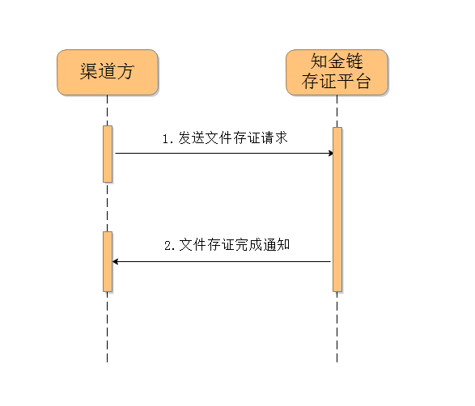
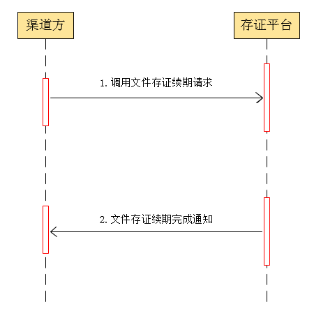

知金链存证业务接口

说明文档

V0.9.4

北京知金链网络技术有限公司

2017年11月

目 录
=====

一 文档说明

`（一） 功能描述 <\l>`__

`（二） 阅读对象 <\l>`__

`（三） 业务术语 <\l>`__

`二 渠道注册 <\l>`__

`（一） 渠道方提供的信息 <\l>`__

`（二） 存证平台返回的注册结果 <\l>`__

`三 文件存证业务 <\l>`__

`（一） 流程说明 <\l>`__

`（二） 知金链存证平台实现接口 <\l>`__

`1． 文件存证接口 <\l>`__

`（三） 渠道方实现接口 <\l>`__

`1． 文件存证完成通知接口 <\l>`__

`四. 文件Hash存证业务 <\l>`__

`（一） 流程说明 <\l>`__

`（二） 存证平台实现接口 <\l>`__

`1. Hash存证接口 <\l>`__

`（三） 渠道方实现接口 <\l>`__

`1． 文件Hash存证完成通知接口 <\l>`__

`五. 文件存证续期业务 <\l>`__

`（一） 流程说明 <\l>`__

`（二） 知金链存证平台实现接口 <\l>`__

`1． 存证续期接口 <\l>`__

`（三） 渠道方实现接口 <\l>`__

`1． 文件存证续期完成通知接口 <\l>`__

`六. 查询相关业务 <\l>`__

`（一） 订单查询接口 <\l>`__

`（二） 根据数字证书和权属人身份标识查询订单接口 <\l>`__

`（三） 原始存证文件下载 <\l>`__

`（四） 存证证书下载（未实现） <\l>`__

`七. 密钥及算法 <\l>`__

`（一） 渠道密钥生成 <\l>`__

`（二） 请求参数sign的生成方法 <\l>`__

`（三） 渠道的订单签名bizSign <\l>`__

`（四） 存证平台的订单签名platformSign <\l>`__

修改记录

+-----------------+-----------------+-----------------+-----------------+
| 序号            | 日期            | 内容            | 操作人员        |
+-----------------+-----------------+-----------------+-----------------+
| 1               | 2017/09/18      | 文件初稿        | 杨立峰          |
+-----------------+-----------------+-----------------+-----------------+
| 2               | 2017/09/30      | 1               | 杨立峰          |
|                 |                 | 渠道注册返回添加参数:Chan |       |
|                 |                 | nelIDA、Platform |                |
|                 |                 | IDA、platformPub |                |
|                 |                 | licKey。        |                 |
|                 |                 |                 |                 |
|                 |                 | 2               |                 |
|                 |                 | 文件存证接口：添加参数bizS |      |
|                 |                 | ign；调整fileHash参 |             |
|                 |                 | 数的生成方式为sm3。 |             |
|                 |                 |                 |                 |
|                 |                 |                 |                 |
|                 |                 | 3               |                 |
|                 |                 | 文件存证完成通知接口：添加参数 |  |
|                 |                 | platformSign。  |                 |
|                 |                 |                 |                 |
|                 |                 | 4               |                 |
|                 |                 | hash存证接口：添加参数bi |        |
|                 |                 | zSign；调整fileHas |              |
|                 |                 | h参数的生成方式为sm3。 |          |
|                 |                 |                 |                 |
|                 |                 |                 |                 |
|                 |                 | 5               |                 |
|                 |                 | 文件hash存证完成通知接口： |      |
|                 |                 | 添加参数platformSig |             |
|                 |                 | n。             |                 |
|                 |                 |                 |                 |
|                 |                 | 6               |                 |
|                 |                 | 续期存证接口：添加参数plat |      |
|                 |                 | formSign。      |                 |
|                 |                 |                 |                 |
|                 |                 | 7               |                 |
|                 |                 | 文件存证续期完成通知接口：添加 |  |
|                 |                 | 参数platformSign |                |
|                 |                 |                 |                 |
|                 |                 |                 |                 |
|                 |                 | 8               |                 |
|                 |                 | “密钥及算法”章节调整。 |          |
+-----------------+-----------------+-----------------+-----------------+
| 3               | 2017/10/12      | 新增以下接口:   | 杨立峰          |
|                 |                 |                 |                 |
|                 |                 | 1订单查询接口   | 汪 伟           |
|                 |                 |                 |                 |
|                 |                 | 2原始存证文件下载 |               |
+-----------------+-----------------+-----------------+-----------------+
| 4               | 2017/11/04      | 文件存证业务流程调整： | 杨立峰   |
|                 |                 |                 |                 |
|                 |                 |                 | 汪 伟           |
|                 |                 | 1.修改带源文件存证流程中的文 |    |
|                 |                 | 件上传方式。    |                 |
|                 |                 |                 |                 |
|                 |                 | 文件上传不再需要调用上传接口， |  |
|                 |                 | 只需要在请求参数中添加源文件的 |  |
|                 |                 | oss文件地址（或其他可读取的 |     |
|                 |                 | url，建议临时性的），存证平 |     |
|                 |                 | 台根据接收的地址获取用户源文件 |  |
|                 |                 | 进行后续处理。  |                 |
|                 |                 |                 |                 |
|                 |                 | 文件存证接口添加fileAdd |         |
|                 |                 | r字段。         |                 |
|                 |                 |                 |                 |
|                 |                 | 2.              |                 |
|                 |                 | 取消文件上传流程、取消file |      |
|                 |                 | Token回调接收流程。 |             |
|                 |                 |                 |                 |
|                 |                 |                 |                 |
|                 |                 | 3.数据库字段调整。 |              |
|                 |                 |                 |                 |
|                 |                 |                 |                 |
|                 |                 | fileName字段长度为30 |            |
|                 |                 | 个字符（汉字或英文）长度。 |      |
|                 |                 |                 |                 |
|                 |                 |                 |                 |
|                 |                 | 简化渠道与知金链存储平台的业务 |  |
|                 |                 | 交互工作        |                 |
+-----------------+-----------------+-----------------+-----------------+
| 5               | 2017/11/28      | 添加各个接口结果的status | 汪伟   |
|                 |                 | 、msg以及建议说明。 |             |
|                 |                 |                 | 郭真真          |
+-----------------+-----------------+-----------------+-----------------+
|                 |                 |                 |                 |
+-----------------+-----------------+-----------------+-----------------+

一 文档说明

#. 功能描述

知金链存证平台为渠道方提供文件存证、文件Hash存证、文件存证续期等业务。本接口说明文档定义了存证平台（服务方）与渠道方（客户方）之间的业务交互接口详情。系统业务接口有两类：知金链存证平台实现的接口及渠道方实现的接口。

渠道方通过存证业务接口，接入知金链存证平台，将需要存证的文件保存到存证业务平台。

具体接口详情请参见以下接口说明。

2. 阅读对象

本文档订单阅读对象包括：了解Java、Python、PHP、Ruby等开发语言的渠道方开发、维护、管理人员。

3. 业务术语

**知金链存证平台**:知金链存证平台是为用户提供文件存证、文件Hash存证、文件存证续期等业务的平台。以下简称“存证平台”。

**渠道方**\ ：渠道方指知金链存证平台的合作方，即调用存证业务的平台。

**文件存证**\ ：文件存证指渠道方将待存证的源文件以及存证描述信息一起传给知金链存证平台的存证业务。

**文件Hash存证**\ ：文件Hash存证指渠道方仅将存证描述信息传给知金链存证平台，而不上传存证源文件的存证业务。

**文件存证续期**\ ：文件存证续期指渠道方针对已有的存证订单，延长该订单存证时长的业务。

二 渠道注册

为了确认渠道方的资格，进行文件存证、文件Hash存证、文件存证续期等业务，渠道方需要在知金链存证平台进行注册。

在进行存证业务时，为了完成存证业务的数据交互，渠道方也需要实现部分回调接口。

渠道方在存证系统进行注册时需要提供基本信息以及存证业务通知回调地址。

#. 渠道方提供的信息

+-------------+-------------+-------------+-------------+-------------+
| **信息项**  | **必选**    | **类型**    | **长度**    | **说明**    |
+-------------+-------------+-------------+-------------+-------------+
| 名称        | true        | String      | 16          | 渠道方名称  |
+-------------+-------------+-------------+-------------+-------------+
| 渠道公钥    | true        | String      |             | 渠道方的国密SM2算法 |
|             |             |             |             | 公钥，hex形式提供。 |
|             |             |             |             | 在进行存证业务的时候， |
|             |             |             |             | 渠道方需要生成SM2密 |
|             |             |             |             | 钥对，以对存证的业务数 |
|             |             |             |             | 据进行签名。参见说明“ |
|             |             |             |             | 渠道密钥生成”。 |
+-------------+-------------+-------------+-------------+-------------+
| 渠道方类型  | true        | String      | 2           | 渠道方类型，可能的取值 |
|             |             |             |             | ：1企业、2政府机关、 |
|             |             |             |             | 3事业单位、4社会团体 |
|             |             |             |             | 、5非盈利性组织、0其 |
|             |             |             |             | 他          |
+-------------+-------------+-------------+-------------+-------------+
| 营业年限    | false       | String      | 3           | 整数        |
+-------------+-------------+-------------+-------------+-------------+
| 渠道方规模  | false       | String      | 5           | 100/300/500 |
|             |             |             |             | 人          |
+-------------+-------------+-------------+-------------+-------------+
| 主营业务    | false       | String      | 10          | 渠道方的主营业务 |
+-------------+-------------+-------------+-------------+-------------+
| 网址        | false       | String      | 50          | 渠道方网址  |
+-------------+-------------+-------------+-------------+-------------+
| 地址        | false       | String      | 50          | 渠道方地址  |
+-------------+-------------+-------------+-------------+-------------+
| 联系人      | true        | String      | 10          | 渠道方联系人 |
+-------------+-------------+-------------+-------------+-------------+
| 联系电话    | true        | String      | 13          | 渠道方联系电话 |
+-------------+-------------+-------------+-------------+-------------+
| 营业执照    | true        | String      | 50          | 渠道方营业执照全称 |
+-------------+-------------+-------------+-------------+-------------+
| 社会统一信用代码 | true   | String      | 50          | 渠道方社会统一信用代码 |
+-------------+-------------+-------------+-------------+-------------+
| 银行账户    | false       | String      | 20          | 对公银行账户名 |
+-------------+-------------+-------------+-------------+-------------+
| 银行账号    | false       | String      | 18          | 对公银行账号 |
+-------------+-------------+-------------+-------------+-------------+
| 创建时间    | true        | String      | 6           | 渠道方公司注册的时间 |
+-------------+-------------+-------------+-------------+-------------+
| 文件存证完成通知地址 | true | String    | 100         | 供存证平台调用，实现文 |
|             |             |             |             | 件存证完成通知，详情参 |
|             |             |             |             | 见“\ `文件存证完成 |
|             |             |             |             | 通知接口 <\l>`_ |
|             |             |             |             | _\ ”。      |
+-------------+-------------+-------------+-------------+-------------+
| 文件Hash存证完成通 | true | String      | 100         | 供存证平台调用，实现文 |
| 知地址      |             |             |             | 件Hash存证完成通知 |
|             |             |             |             | ，详情参见“\ `文件 |
|             |             |             |             | Hash存证完成通知接 |
|             |             |             |             | 口 <\l>`__\  |
|             |             |             |             | ”。         |
+-------------+-------------+-------------+-------------+-------------+
| 文件存证续期完成通知地 | true | String  | 100         | 供存证平台调用，实现文 |
| 址          |             |             |             | 件存证续期完成通知，详 |
|             |             |             |             | 情参见“\ `文件存证 |
|             |             |             |             | 续期完成通知接口 <\ |
|             |             |             |             | l>`__\ ”。  |
+-------------+-------------+-------------+-------------+-------------+

2. 存证平台返回的注册结果

+-----------+-----------+-----------+-----------+-----------+-----------+
| **参数名** | **数据项** | **必选** | **类型** | **长度**  | **说明**  |
+-----------+-----------+-----------+-----------+-----------+-----------+
| channelId | 渠道标识  | true      | String 3  | 3         | 平台根据渠道信息生 |
|           |           |           | 平台根据渠道信息生 |  | 成，是渠道的唯一标 |
|           |           |           | 成，是渠道的唯一标 |  | 识。      |
|           |           |           | 识。      |           |           |
+-----------+-----------+-----------+-----------+-----------+-----------+
| accessKey | 接口访问标识 | true   | String    | 44        | 平台根据渠道方的公 |
|           |           |           |           |           | 钥生成，业务请求参 |
|           |           |           |           |           | 数        |
+-----------+-----------+-----------+-----------+-----------+-----------+
| channelID | 渠道标识  | true      | String    | 50        | 渠道标识，用于渠道 |
| A         |           |           |           |           | 的签名算法。 |
+-----------+-----------+-----------+-----------+-----------+-----------+
| platformI | 存证平台标识 | true   | String    | 50        | 平台标识，用于平台 |
| DA        |           |           |           |           | 的签名算法。 |
+-----------+-----------+-----------+-----------+-----------+-----------+
| platformP | 存证平台的公钥 | true | String    |           | 用于验证平台的订单 |
| ublicKey  |           |           |           |           | 签名。密钥相关的 |
+-----------+-----------+-----------+-----------+-----------+-----------+

说明：上面前两个参数是渠道发起存证业务的必须参数。

三 文件存证业务

#. 流程说明

文件存证业务的功能为接收用户上传的图片、文档等文件，进行存证。文件存证业务流程如下图所示：

   |image0|

   图1 文件存证业务流程图

业务流程说明：

1、渠道方发起文件存证业务，调用存证平台的“文件存证”接口，将存证的详细业务信息提交给知金链存证平台。

2、知金链存证平台对文件存证请求进行安全、权限等一系列校验处理后，调用渠道方的“文件存证完成通知”接口，通知渠道方已完成文件存证业务。

2. 知金链存证平台实现接口

1. 文件存证接口

接口说明：

   由知金链存证平台提供，供渠道方调用，用于接收文件存证请求的详细业务信息。注意最终存证的开始时间以存证平台返回的为准，存证持续时间不变。

请求地址：

   http://cz.zhijl.com/interface/createFileAttest

接口形式：

   Http POST请求。

请求参数：

+-----------+-----------+-----------+-----------+-----------+-----------+
| **参数名** | **数据项** | **必选** | **类型** | **长度**  | **说明**  |
+-----------+-----------+-----------+-----------+-----------+-----------+
| signType  | 签名类型  | true      | String    | 10        | 请求的签名类型，目 |
|           |           |           |           |           | 前固定值"MD5" |
|           |           |           |           |           | 。        |
+-----------+-----------+-----------+-----------+-----------+-----------+
| sign      | 签名      | true      | String    | 24        | 本次请求的参数签名 |
|           |           |           |           |           | 。签名方法参见“\ |
|           |           |           |           |           |  `请求参数sig |
|           |           |           |           |           | n的生成方法 <\ |
|           |           |           |           |           | l>`__\ ”。 |
+-----------+-----------+-----------+-----------+-----------+-----------+
| accessKey | 接口访问标识 | true   | String    | 44        | 渠道请求访问标识， |
|           |           |           |           |           | 固定值。渠道方提交 |
|           |           |           |           |           | 公钥后由存证平台生 |
|           |           |           |           |           | 成，参见“\ `存 |
|           |           |           |           |           | 证平台返回的注册结 |
|           |           |           |           |           | 果 <\l>`__ |
|           |           |           |           |           | \ ”。     |
+-----------+-----------+-----------+-----------+-----------+-----------+
| random    | 随机字符串 | true     | String    | 32        | 请求随机字符串。由 |
|           |           |           |           |           | 渠道生成的32位随 |
|           |           |           |           |           | 机字符串，每次请求 |
|           |           |           |           |           | 的随机串必须重新生 |
|           |           |           |           |           | 成。      |
+-----------+-----------+-----------+-----------+-----------+-----------+
| bizSign   | 渠道签名  | true      | String    | 88        | 渠道采用私钥对本存 |
|           |           |           |           |           | 证记录数据的签名。 |
|           |           |           |           |           | 具体方法参见“\  |
|           |           |           |           |           | `渠道的订单签名  |
|           |           |           |           |           | <\l>`__\  |
|           |           |           |           |           | ”。       |
+-----------+-----------+-----------+-----------+-----------+-----------+
| requestTi | 请求时间  | true      | String    | 15        | 本次请求的发起时间 |
| me        |           |           |           |           | 。        |
|           |           |           |           |           |           |
|           |           |           |           |           | 格式：yyyyMM |
|           |           |           |           |           | dd-HHmmss |
|           |           |           |           |           |           |
|           |           |           |           |           | 示例：“20170 |
|           |           |           |           |           | 911-13421 |
|           |           |           |           |           | 1”，表示2017 |
|           |           |           |           |           | 年9月11日，13 |
|           |           |           |           |           | 点42分11秒。 |
|           |           |           |           |           |           |
|           |           |           |           |           |           |
|           |           |           |           |           | 参与渠道签名。 |
+-----------+-----------+-----------+-----------+-----------+-----------+
| channelId | 渠道ID    | true      | String    | 3         | 渠道ID。由知金链 |
|           |           |           |           |           | 存证平台生成，参见 |
|           |           |           |           |           | “\ `渠道注册返 |
|           |           |           |           |           | 回结果 <\l>` |
|           |           |           |           |           | __\ ”。   |
|           |           |           |           |           |           |
|           |           |           |           |           | 参与渠道签名。 |
+-----------+-----------+-----------+-----------+-----------+-----------+
| channelUs | 渠道用户标识 | true   | String    | 50        | 渠道用户唯一标识。 |
| erid      |           |           |           |           |           |
|           |           |           |           |           |           |
|           |           |           |           |           | 参与渠道签名。 |
+-----------+-----------+-----------+-----------+-----------+-----------+
| channelOr | 渠道订单号 | true     | String    | 50        | 渠道的存证订单唯一 |
| dersn     |           |           |           |           | 标识。    |
|           |           |           |           |           |           |
|           |           |           |           |           | 参与渠道签名。 |
+-----------+-----------+-----------+-----------+-----------+-----------+
| chained   | 入链情况  | false     | String    | 1         | 是否入链。取值范围 |
|           |           |           |           |           | ：1、0。  |
|           |           |           |           |           |           |
|           |           |           |           |           | “1”入链，”0” |
|           |           |           |           |           | 不入链。  |
|           |           |           |           |           |           |
|           |           |           |           |           | 参与渠道签名。 |
+-----------+-----------+-----------+-----------+-----------+-----------+
| bizType   | 存证文件类型 | true   | String    | 2         | 确定存证文件的类型 |
|           |           |           |           |           | ，包括：1文字\2 |
|           |           |           |           |           | 图片\3视频\4音 |
|           |           |           |           |           | 频\5压缩\6其他 |
|           |           |           |           |           |           |
|           |           |           |           |           |           |
|           |           |           |           |           | 参与渠道签名。 |
+-----------+-----------+-----------+-----------+-----------+-----------+
| fileName  | 文件名称  | true      | String    | 30        | 存证文件名称。 |
|           |           |           |           |           |           |
|           |           |           |           |           |           |
|           |           |           |           |           | 参与渠道签名。 |
+-----------+-----------+-----------+-----------+-----------+-----------+
| fileType  | 文件类型  | true      | String    | 10        | 文件的后缀名。 |
|           |           |           |           |           |           |
|           |           |           |           |           |           |
|           |           |           |           |           | 例：.txt，.d |
|           |           |           |           |           | oc，.img，. |
|           |           |           |           |           | png等格式。 |
|           |           |           |           |           |           |
|           |           |           |           |           |           |
|           |           |           |           |           | 参与渠道签名。 |
+-----------+-----------+-----------+-----------+-----------+-----------+
| fileSize  | 文件长度  | true      | String    | 20        | 存证内容文件长度， |
|           |           |           |           |           | 字节为单位。 |
|           |           |           |           |           |           |
|           |           |           |           |           |           |
|           |           |           |           |           | 参与渠道签名。 |
+-----------+-----------+-----------+-----------+-----------+-----------+
| fileHash  | 文件哈希值 | true     | String    | 44        | 客户原始文件的国密 |
|           |           |           |           |           | SM3算法摘要，b |
|           |           |           |           |           | ase64编码形式 |
|           |           |           |           |           | 的字符串。 |
|           |           |           |           |           |           |
|           |           |           |           |           |           |
|           |           |           |           |           | 参与渠道签名。 |
+-----------+-----------+-----------+-----------+-----------+-----------+
| fileAddr  | 文件OSS传输地址 | true | String   | 255       | 存证源文件的临时O |
|           |           |           |           |           | SS地址。用于存证 |
|           |           |           |           |           | 平台获取用户存证源 |
|           |           |           |           |           | 文件文件，进行后续 |
|           |           |           |           |           | 的校验、存储等操作 |
|           |           |           |           |           | 。        |
+-----------+-----------+-----------+-----------+-----------+-----------+
| ownerType | 权属人类型 | true     | String    | 1         | 权属人类型，包括自 |
|           |           |           |           |           | 然人、法人、其他三 |
|           |           |           |           |           | 种类型。  |
|           |           |           |           |           |           |
|           |           |           |           |           | 1为自然人，2为法 |
|           |           |           |           |           | 人，9为其他 |
|           |           |           |           |           |           |
|           |           |           |           |           |           |
|           |           |           |           |           | 参与渠道签名。 |
+-----------+-----------+-----------+-----------+-----------+-----------+
| ownerId   | 权属人身份标识 | true | String    | 18        | 权属人身份标识。当 |
|           |           |           |           |           | 权属人类型是自然人 |
|           |           |           |           |           | 时，填写身份证号； |
|           |           |           |           |           | 当前权属人类型是法 |
|           |           |           |           |           | 人时，填写统一社会 |
|           |           |           |           |           | 信用代码。 |
|           |           |           |           |           |           |
|           |           |           |           |           |           |
|           |           |           |           |           | 例：4130251 |
|           |           |           |           |           | 988090911 |
|           |           |           |           |           | 22        |
|           |           |           |           |           |           |
|           |           |           |           |           | 参与渠道签名。 |
+-----------+-----------+-----------+-----------+-----------+-----------+
| ownerName | 权属人名称 | true     | String    | 64        | 权属人名称。 |
|           |           |           |           |           |           |
|           |           |           |           |           |           |
|           |           |           |           |           | 参与渠道签名。 |
+-----------+-----------+-----------+-----------+-----------+-----------+
| agentName | 代理人姓名 | true     | String    | 32        | 本次业务的代理人名 |
|           |           |           |           |           | 称。      |
+-----------+-----------+-----------+-----------+-----------+-----------+
| agentPhon | 代理人电话 | true     | String    | 11        | 代理人联系方式。格 |
| e         |           |           |           |           | 式：区号+电话 |
|           |           |           |           |           |           |
|           |           |           |           |           |           |
|           |           |           |           |           | 例：0108888 |
|           |           |           |           |           | 6666      |
+-----------+-----------+-----------+-----------+-----------+-----------+
| agentEmai | 代理人邮箱 | true     | String    | 100       | 代理人邮箱。 |
| l         |           |           |           |           |           |
+-----------+-----------+-----------+-----------+-----------+-----------+
| duration  | 存证时间长度 | true   | String    | 5         | 以天为单位的时间长 |
|           |           |           |           |           | 度，十进制表示。 |
|           |           |           |           |           |           |
|           |           |           |           |           |           |
|           |           |           |           |           | 参与渠道签名。 |
+-----------+-----------+-----------+-----------+-----------+-----------+
| descripti | 存证描述信息 | false  | String    | 200       | 存证描述。 |
| on        |           |           |           |           |           |
|           |           |           |           |           |           |
|           |           |           |           |           | 参与渠道签名。 |
+-----------+-----------+-----------+-----------+-----------+-----------+
| price     | 价格      | true      | String    | 10        | 订单价格,以“元” |
|           |           |           |           |           | 为单位。  |
+-----------+-----------+-----------+-----------+-----------+-----------+

+-----------------------------------------------------------------------+
| 请求参数示例：                                                        |
|                                                                       |
| &accessKey=2kDv8FXEzb69pk261PXPQ65KezG2fzbbHX7SrUEYkkabk74yHa&agentEm |
| ail=e98a19c77ad@.com&agentName=agent3fb0d&agentPhone=4590904&bizSign= |
| Ln4P8Jmk/ws+PBek7xjjEh+t1QoDGlqEqftGIvuI6CiEru9yMeHHyAaJSx0gqAGxF3GP3 |
| i/4ClIb85wayq2ZcA==&bizType=1&chained=1&channelId=005&channelOrdersn= |
| ordersnc428e36af&channelUserid=453&description=描述:{"accessKey":"2kDv8 |
| FXEzb69pk261PXPQ65KezG2fzbbHX7SrUEYkkabk74yHa","agentEmail":"e98a19c7 |
| 7ad@.com","agentName":"agent3fb0d","agentPhone":"4590904","biz&durati |
| on=3&fileAddr=http://osstestoss.oss-cn-beijing.aliyuncs.com/%E6%B5%8B |
| %E8%AF%95-ordersnc428e36af?Expires=1512703606&OSSAccessKeyId=LTAIBZFt |
| pYe3Cmdn&Signature=TqCMw%2Fnsms1dOMShfVdxlEioDYE%3D&fileHash=Xk0LNidH |
| +LEP8Q/f3mGDqi9ww63JnxtVHOEeojrrH+k=&fileName=测试-ordersnc428e36af&fil |
| eSize=500&fileType=.669&ownerId=ownerid1&ownerName=权属人d8a3&ownerType= |
| 1&price=150&random=c7c782567cd846f6841e65f0e6984861&requestTime=20171 |
| 118-112645                                                            |
+-----------------------------------------------------------------------+

返回结果说明：

以JSON格式数据返回结果。调用方可以根据success、status字段进行业务逻辑判断，按照建议进行后续操作。

+-----------------------------------+-----------------------------------+
| 参数                              | 描述                              |
+-----------------------------------+-----------------------------------+
| success                           | 本次请求处理结果。                |
|                                   |                                   |
|                                   | true为本次请求业务处理完成，无需后续操作；false为本次业务 |
|                                   | 处理失败，需要客户端根据建议进行修改或其他操作。 |
+-----------------------------------+-----------------------------------+
| status                            | 本次请求处理结果的状态码。客户端可以根据状态码进行对应的后续处理。 |
|                                   |                                   |
|                                   |                                   |
|                                   | “1”表示处理成功；“0”表示处理失败，“-1”表示处理异常 |
+-----------------------------------+-----------------------------------+
| msg                               | 本次请求处理结果说明              |
+-----------------------------------+-----------------------------------+
|                                   |                                   |
+-----------------------------------+-----------------------------------+
| Data                              | 返回结果对象。以JSON形式返回      |
+-----------------------------------+-----------------------------------+

..

   JsonResult状态说明:

+-----------------+-----------------+-----------------+-----------------+
| success         | status          | msg             | 建议            |
+-----------------+-----------------+-----------------+-----------------+
| true            | 1               | 存证请求接收完成。 | 无。         |
+-----------------+-----------------+-----------------+-----------------+
| true            | 6               | 该订单正处于业务受理中。 | 无。   |
+-----------------+-----------------+-----------------+-----------------+
| false           | -4              | 对应OSS文件Hash值为空。 | 核实文件Hash值。 |
+-----------------+-----------------+-----------------+-----------------+
| false           | -20             | 请求参数不合法，详情根据请求参 | 核实请求参数的长度、是否为空、 |
|                 |                 | 数确定。        | 是否符合接口规定的格式。 |
+-----------------+-----------------+-----------------+-----------------+
| false           | -21             | 请求时间requestTime | 核实请求时间格式。 |
|                 |                 | 格式错误.请参考yyyyMMd |          |
|                 |                 | d-HHmmss格式。  |                 |
+-----------------+-----------------+-----------------+-----------------+
| false           | -30             | 请求随机数不合法。 | 请采用请求随机数。 |
+-----------------+-----------------+-----------------+-----------------+
| false           | -40             | 渠道ID不存在。  | 核实渠道ID是否正确。 |
+-----------------+-----------------+-----------------+-----------------+
| false           | -50             | 请求标识accessKey不匹 | 采用正确的渠道标识。 |
|                 |                 | 配该渠道accessKey。 |             |
+-----------------+-----------------+-----------------+-----------------+
| false           | -60             | 请求签名类型signType不 | 核实签名类型。 |
|                 |                 | 匹配。          |                 |
+-----------------+-----------------+-----------------+-----------------+
| false           | -70             | 请求签名sign校验未通过。 | 核实签名。 |
+-----------------+-----------------+-----------------+-----------------+
| false           | -80             | 订单签名bizSign校验未通 | 核实订单签名。 |
|                 |                 | 过。            |                 |
+-----------------+-----------------+-----------------+-----------------+
| false           | -90             | 渠道订单号channelOrd | 核实渠道订单号。 |
|                 |                 | ersn已存在。    |                 |
+-----------------+-----------------+-----------------+-----------------+
| false           | -103            | 文件长度不匹配。 | 核实文件长度。 |
+-----------------+-----------------+-----------------+-----------------+
| false           | -104            | 文件Hash不匹配。 | 核实文件Hash值。 |
+-----------------+-----------------+-----------------+-----------------+
| false           | -999            | 业务异常。      | 重试请求，或者联系管理员。 |
+-----------------+-----------------+-----------------+-----------------+

3. 渠道方实现接口

1. 文件存证完成通知接口

接口说明：

   由渠道方提供，供知金链存证平台调用，用于推送文件存证结果。

请求地址：

   渠道方在\ `渠道注册 <\l>`__\ 阶段提供给存证平台的信息，用于接受文件存证完成通知信息。

接口形式：

   Http POST请求

请求参数：

+-----------+-----------+-----------+-----------+-----------+-----------+
| **参数名** | **数据项** | **必选** | **类型** | **长度**  | **说明**  |
+-----------+-----------+-----------+-----------+-----------+-----------+
| signType  | 签名类型  | true      | String    | 10        | 请求的签名类型，目 |
|           |           |           |           |           | 前固定值"MD5" |
|           |           |           |           |           | 。        |
+-----------+-----------+-----------+-----------+-----------+-----------+
| sign      | 签名      | true      | String    | 24        | 本次请求的参数签名 |
|           |           |           |           |           | 。签名方法参见“\ |
|           |           |           |           |           |  `请求参数签名算 |
|           |           |           |           |           | 法 <\l>`__ |
|           |           |           |           |           | \ ”。     |
+-----------+-----------+-----------+-----------+-----------+-----------+
| random    | 随机字符串 | true     | String    | 32        | 请求随机字符串。由 |
|           |           |           |           |           | 渠道生成的32位随 |
|           |           |           |           |           | 机字符串，每次请求 |
|           |           |           |           |           | 的随机串必须重新生 |
|           |           |           |           |           | 成。      |
+-----------+-----------+-----------+-----------+-----------+-----------+
| ordersn   | 存证平台的 | true     | String    | 18        | 知金链存证平台生成 |
|           |           |           |           |           | 的唯一订单存证号 |
|           |           |           |           |           |           |
|           | 唯一存证号 |          |           |           |           |
+-----------+-----------+-----------+-----------+-----------+-----------+
| channelOr | 渠道订单号 | true     | String    | 50        | 渠道的存证订单唯一 |
| dersn     |           |           |           |           | 标识。    |
+-----------+-----------+-----------+-----------+-----------+-----------+
| startTime | 当前存证  | true      | String    | 15        | 存证平台返回的当前 |
|           |           |           |           |           | 存证有效起始时间。 |
|           | 起始时间  |           |           |           |           |
+-----------+-----------+-----------+-----------+-----------+-----------+
| duration  | 存证时间  | true      | String    | 5         | 以天为单位的时间长 |
|           |           |           |           |           | 度。      |
|           | 长度      |           |           |           |           |
+-----------+-----------+-----------+-----------+-----------+-----------+
| platformS | 存证平台的订单签名 | True | String | 24       | 存证平台对订单的签 |
| ign       |           |           |           |           | 名。参见“\ `存 |
|           |           |           |           |           | 证平台的订单签名  |
|           |           |           |           |           | <\l>`__\  |
|           |           |           |           |           | ”         |
+-----------+-----------+-----------+-----------+-----------+-----------+

返回结果说明：

   JSON格式数据。具体参数含义请参考“\ `JsonResult状态说明 <\l>`__\ ”

返回结果示例：

   {

   "success":true,

   "status":"1",

   "msg":"文件存证通知接收完成"

   "data":"参数信息"

   }

   其他情况，返回描述结果的Json字符串信息：

返回结果示例：

   {

   "success":false,

   "status":"0",

   "msg":"处理失败"

   "data":"参数信息"

   }

四. 文件Hash存证业务

#. 流程说明

Hash存证业务的功能为：接收用户上传的Hash文件，并进行存证。Hash存证业务通过Hash存证请求及Hash存证完成两个接口实现，其流程如下图所示：

   |1505128060(1)|

   图2 Hash存证业务流程图

业务流程说明：

1、
渠道方在进行Hash存证业务时，首先需要将存证的相关信息、文件Hash及签名提交给Hash存证请求接口。

2、
存证系统平台对存证请求进行安全、权限校验处理后，完成文件Hash存证其余操作，然后调用“文件Hash存证完成通知”接口。

2. 存证平台实现接口

1. Hash存证接口

接口说明：

   由渠道方提供，供知金链存证平台调用，用于推送文件存证结果。

请求地址：

http://cz.zhijl.com/interface/createHastAttest

接口形式：

   Http POST请求。

请求参数：

+-----------+-----------+-----------+-----------+-----------+-----------+
| **参数名** | **数据项** | **必选** | **类型** | **长度**  | **说明**  |
+-----------+-----------+-----------+-----------+-----------+-----------+
| signType  | 签名类型  | true      | String    | 10        | 请求的签名类型，目 |
|           |           |           |           |           | 前固定值"MD5" |
|           |           |           |           |           | 。        |
+-----------+-----------+-----------+-----------+-----------+-----------+
| sign      | 签名      | true      | String    | 24        | 本次请求的参数签名 |
|           |           |           |           |           | 。签名方法参见“\ |
|           |           |           |           |           |  `请求参数sig |
|           |           |           |           |           | n的生成方法 <\ |
|           |           |           |           |           | l>`__\ ”。 |
+-----------+-----------+-----------+-----------+-----------+-----------+
| accessKey | 接口访问标识 | true   | String    | 44        | 渠道请求访问标识， |
|           |           |           |           |           | 固定值。渠道方提交 |
|           |           |           |           |           | 公钥后由存证平台生 |
|           |           |           |           |           | 成，参见“\ `存 |
|           |           |           |           |           | 证平台返回的注册结 |
|           |           |           |           |           | 果 <\l>`__ |
|           |           |           |           |           | \ ”。     |
+-----------+-----------+-----------+-----------+-----------+-----------+
| random    | 随机字符串 | true     | String    | 32        | 请求随机字符串。由 |
|           |           |           |           |           | 渠道生成的32位随 |
|           |           |           |           |           | 机字符串，每次请求 |
|           |           |           |           |           | 的随机串必须重新生 |
|           |           |           |           |           | 成。      |
+-----------+-----------+-----------+-----------+-----------+-----------+
| bizSign   | 渠道签名  | true      | String    | 88        | 渠道采用私钥对本存 |
|           |           |           |           |           | 证记录数据的签名。 |
|           |           |           |           |           | 具体方法参见“\  |
|           |           |           |           |           | `渠道的订单签名  |
|           |           |           |           |           | <\l>`__\  |
|           |           |           |           |           | ”。       |
+-----------+-----------+-----------+-----------+-----------+-----------+
| requestTi | 请求时间  | true      | String    | 15        | 本次请求的发起时间 |
| me        |           |           |           |           | 。        |
|           |           |           |           |           |           |
|           |           |           |           |           | 格式：yyyyMM |
|           |           |           |           |           | dd-HHmmss |
|           |           |           |           |           |           |
|           |           |           |           |           | 示例：“20170 |
|           |           |           |           |           | 911-13421 |
|           |           |           |           |           | 1”，表示2017 |
|           |           |           |           |           | 年9月11日，13 |
|           |           |           |           |           | 点42分11秒。 |
|           |           |           |           |           |           |
|           |           |           |           |           |           |
|           |           |           |           |           | 参与渠道签名。 |
+-----------+-----------+-----------+-----------+-----------+-----------+
| channelId | 渠道ID    | true      | String    | 3         | 渠道ID。由知金链 |
|           |           |           |           |           | 存证平台生成，参见 |
|           |           |           |           |           | “\ `渠道注册返 |
|           |           |           |           |           | 回结果 <\l>` |
|           |           |           |           |           | __\ ”。   |
|           |           |           |           |           |           |
|           |           |           |           |           | 参与渠道签名。 |
+-----------+-----------+-----------+-----------+-----------+-----------+
| channelUs | 渠道用户标识 | true   | String    | 50        | 渠道用户唯一标识。 |
| erid      |           |           |           |           |           |
|           |           |           |           |           |           |
|           |           |           |           |           | 参与渠道签名。 |
+-----------+-----------+-----------+-----------+-----------+-----------+
| channelOr | 渠道订单号 | true     | String    | 50        | 渠道的存证订单唯一 |
| dersn     |           |           |           |           | 标识。    |
|           |           |           |           |           |           |
|           |           |           |           |           | 参与渠道签名。 |
+-----------+-----------+-----------+-----------+-----------+-----------+
| chained   | 入链情况  | false     | String    | 1         | 是否入链。取值范围 |
|           |           |           |           |           | ：1、0。  |
|           |           |           |           |           |           |
|           |           |           |           |           | “1”入链，”0” |
|           |           |           |           |           | 不入链。  |
|           |           |           |           |           |           |
|           |           |           |           |           | 参与渠道签名。 |
+-----------+-----------+-----------+-----------+-----------+-----------+
| bizType   | 存证文件类型 | true   | String    | 2         | 确定存证文件的类型 |
|           |           |           |           |           | ，包括：1文字\2 |
|           |           |           |           |           | 图片\3视频\4音 |
|           |           |           |           |           | 频\5压缩\6其他 |
|           |           |           |           |           |           |
|           |           |           |           |           |           |
|           |           |           |           |           | 参与渠道签名。 |
+-----------+-----------+-----------+-----------+-----------+-----------+
| fileName  | 文件名称  | true      | String    | 30        | 存证文件名称。 |
|           |           |           |           |           |           |
|           |           |           |           |           |           |
|           |           |           |           |           | 参与渠道签名。 |
+-----------+-----------+-----------+-----------+-----------+-----------+
| fileType  | 文件类型  | true      | String    | 10        | 文件的后缀名。 |
|           |           |           |           |           |           |
|           |           |           |           |           |           |
|           |           |           |           |           | 例：.txt，.d |
|           |           |           |           |           | oc，.img，. |
|           |           |           |           |           | png等格式。 |
|           |           |           |           |           |           |
|           |           |           |           |           |           |
|           |           |           |           |           | 参与渠道签名。 |
+-----------+-----------+-----------+-----------+-----------+-----------+
| fileSize  | 文件长度  | true      | String    | 20        | 存证内容文件长度， |
|           |           |           |           |           | 字节为单位。 |
|           |           |           |           |           |           |
|           |           |           |           |           |           |
|           |           |           |           |           | 参与渠道签名。 |
+-----------+-----------+-----------+-----------+-----------+-----------+
| fileHash  | 文件哈希值 | true     | String    | 44        | 客户原始文件的国密 |
|           |           |           |           |           | SM3算法摘要，b |
|           |           |           |           |           | ase64编码形式 |
|           |           |           |           |           | 的字符串。 |
|           |           |           |           |           |           |
|           |           |           |           |           |           |
|           |           |           |           |           | 参与渠道签名。 |
+-----------+-----------+-----------+-----------+-----------+-----------+
| ownerType | 权属人类型 | true     | String    | 1         | 权属人类型，包括自 |
|           |           |           |           |           | 然人、法人、其他三 |
|           |           |           |           |           | 种类型。  |
|           |           |           |           |           |           |
|           |           |           |           |           | 1为自然人，2为法 |
|           |           |           |           |           | 人，9为其他 |
|           |           |           |           |           |           |
|           |           |           |           |           |           |
|           |           |           |           |           | 参与渠道签名。 |
+-----------+-----------+-----------+-----------+-----------+-----------+
| ownerId   | 权属人身份标识 | true | String    | 18        | 权属人身份标识。当 |
|           |           |           |           |           | 权属人类型是自然人 |
|           |           |           |           |           | 时，填写身份证号； |
|           |           |           |           |           | 当前权属人类型是法 |
|           |           |           |           |           | 人时，填写统一社会 |
|           |           |           |           |           | 信用代码。 |
|           |           |           |           |           |           |
|           |           |           |           |           |           |
|           |           |           |           |           | 例：4130251 |
|           |           |           |           |           | 988090911 |
|           |           |           |           |           | 22        |
|           |           |           |           |           |           |
|           |           |           |           |           | 参与渠道签名。 |
+-----------+-----------+-----------+-----------+-----------+-----------+
| ownerName | 权属人名称 | true     | String    | 64        | 权属人名称。 |
|           |           |           |           |           |           |
|           |           |           |           |           |           |
|           |           |           |           |           | 参与渠道签名。 |
+-----------+-----------+-----------+-----------+-----------+-----------+
| agentName | 代理人姓名 | true     | String    | 32        | 本次业务的代理人名 |
|           |           |           |           |           | 称。      |
+-----------+-----------+-----------+-----------+-----------+-----------+
| agentPhon | 代理人电话 | true     | String    | 11        | 代理人联系方式。格 |
| e         |           |           |           |           | 式：区号+电话 |
|           |           |           |           |           |           |
|           |           |           |           |           |           |
|           |           |           |           |           | 例：0108888 |
|           |           |           |           |           | 6666      |
+-----------+-----------+-----------+-----------+-----------+-----------+
| agentEmai | 代理人邮箱 | true     | String    | 100       | 代理人邮箱。 |
| l         |           |           |           |           |           |
+-----------+-----------+-----------+-----------+-----------+-----------+
| duration  | 存证时间长度 | true   | String    | 5         | 以天为单位的时间长 |
|           |           |           |           |           | 度，十进制表示。 |
|           |           |           |           |           |           |
|           |           |           |           |           |           |
|           |           |           |           |           | 参与渠道签名。 |
+-----------+-----------+-----------+-----------+-----------+-----------+
| descripti | 存证描述信息 | false  | String    | 200       | 存证描述。 |
| on        |           |           |           |           |           |
|           |           |           |           |           |           |
|           |           |           |           |           | 参与渠道签名。 |
+-----------+-----------+-----------+-----------+-----------+-----------+
| price     | 价格      | true      | String    | 10        | 订单价格,以“元” |
|           |           |           |           |           | 为单位。  |
+-----------+-----------+-----------+-----------+-----------+-----------+

+-----------------------------------------------------------------------+
| 请求参数示例                                                          |
|                                                                       |
| &accessKey=2kDv8FXEzb69pk261PXPQ65KezG2fzbbHX7SrUEYkkabk74yHa&agentEm |
| ail=71b513b70e2@.com&agentName=agent10c12&agentPhone=3727692&bizSign= |
| aGHKqp1x5DDx55Kec+mSJOL/CV9sB4npSNp1hSJuGcojMatsTWqyjsqnuv4Lsh8JKhp1b |
| qz+TUSPFJBvG+xufg==&bizType=4&chained=1&channelId=005&channelOrdersn= |
| ordersnc642150df&channelUserid=70f&description=描述:{"accessKey":"2kDv8 |
| FXEzb69pk261PXPQ65KezG2fzbbHX7SrUEYkkabk74yHa","agentEmail":"71b513b7 |
| 0e2@.com","agentName":"agent10c12","agentPhone":"3727692","biz&durati |
| on=5&fileHash=01650c763d33418f8473907a729566a2d9f5a102b412&fileName=捡 |
| 到一分钱ordersnc642150df&fileSize=309&fileType=.313&ownerId=ownerid1&owne |
| rName=权属人ff35&ownerType=2&price=150&random=6e42063b75af4c348106f66311 |
| 3e1e83&requestTime=20171106-104128                                    |
+-----------------------------------------------------------------------+

返回结果说明：

以JSON格式数据返回结果。调用方可以根据success、status字段进行业务逻辑判断，按照建议进行后续操作。

+-----------------+-----------------+-----------------+-----------------+
| success         | status          | msg             | 建议            |
+-----------------+-----------------+-----------------+-----------------+
| true            | 1               | 存证请求接收完成。 | 无。         |
+-----------------+-----------------+-----------------+-----------------+
| true            | 6               | 该订单正处于业务受理中。 | 无。   |
+-----------------+-----------------+-----------------+-----------------+
| false           | -20             | 请求参数不合法，详情根据请求参 | 核实请求参数的长度、是否为空、 |
|                 |                 | 数确定。        | 是否符合接口规定的格式。 |
+-----------------+-----------------+-----------------+-----------------+
| false           | -21             | 请求时间requestTime | 核实请求时间格式。 |
|                 |                 | 格式错误.请参考yyyyMMd |          |
|                 |                 | d-HHmmss格式。  |                 |
+-----------------+-----------------+-----------------+-----------------+
| false           | -30             | 请求随机数不合法。 | 请采用请求随机数。 |
+-----------------+-----------------+-----------------+-----------------+
| false           | -40             | 渠道ID不存在。  | 核实渠道ID。    |
+-----------------+-----------------+-----------------+-----------------+
| false           | -50             | 请求标识accessKey不匹 | 采用正确的渠道标识。 |
|                 |                 | 配该渠道accessKey。 |             |
+-----------------+-----------------+-----------------+-----------------+
| false           | -60             | 请求签名类型signType不 | 核实签名类型。 |
|                 |                 | 匹配。          |                 |
+-----------------+-----------------+-----------------+-----------------+
| false           | -70             | 请求签名sign校验未通过。 | 核实签名。 |
+-----------------+-----------------+-----------------+-----------------+
| false           | -80             | 订单签名bizSign校验未通 | 核实订单签名。 |
|                 |                 | 过。            |                 |
+-----------------+-----------------+-----------------+-----------------+
| false           | -90             | 渠道订单号channelOrd | 核实渠道订单号。 |
|                 |                 | ersn已存在。    |                 |
+-----------------+-----------------+-----------------+-----------------+
| false           | -999            | 业务异常。      | 重试请求，或者联系管理员。 |
+-----------------+-----------------+-----------------+-----------------+

3. 渠道方实现接口

1. 文件Hash存证完成通知接口

接口说明：

   由渠道方提供，供知金链存证平台调用，用于接收文件Hash存证请求。

请求地址：

   渠道方在\ `渠道注册 <\l>`__\ 阶段提供给存证平台的信息，用于接受文件Hash存证完成通知信息。

接口形式：

   Http POST请求。

请求参数：

+-----------+-----------+-----------+-----------+-----------+-----------+
| **参数名** | **数据项** | **必选** | **类型** | **长度**  | **说明**  |
+-----------+-----------+-----------+-----------+-----------+-----------+
| signType  | 签名类型  | true      | String    | 10        | 请求的签名类型，目 |
|           |           |           |           |           | 前固定值"MD5" |
|           |           |           |           |           | 。        |
+-----------+-----------+-----------+-----------+-----------+-----------+
| sign      | 签名      | true      | String    | 24        | 本次请求的参数签名 |
|           |           |           |           |           | 。签名方法参见“\ |
|           |           |           |           |           |  `请求参数签名算 |
|           |           |           |           |           | 法 <\l>`__ |
|           |           |           |           |           | \ ”。     |
+-----------+-----------+-----------+-----------+-----------+-----------+
| random    | 随机字符串 | true     | String    | 32        | 请求随机字符串。由 |
|           |           |           |           |           | 渠道生成的32位随 |
|           |           |           |           |           | 机字符串，每次请求 |
|           |           |           |           |           | 的随机串必须重新生 |
|           |           |           |           |           | 成。      |
+-----------+-----------+-----------+-----------+-----------+-----------+
| channelOr | 渠道存证订单唯一标 | true | String | 50       | 渠道的唯一订单标识 |
| dersn     | 识        |           |           |           |           |
+-----------+-----------+-----------+-----------+-----------+-----------+
| ordersn   | 存证平台生成的 | true | String    | 18        | 由平台生成的唯一的 |
|           |           |           |           |           | 订单存证号 |
|           |           |           |           |           |           |
|           | 唯一存证号 |          |           |           |           |
+-----------+-----------+-----------+-----------+-----------+-----------+
| startTime | 当前存证  | true      | String    | 15        | 存储活跃的当前存证 |
|           |           |           |           |           | 起始时间。 |
|           | 起始时间  |           |           |           |           |
|           |           |           |           |           |           |
|           |           |           |           |           | 存证时间与当前系统 |
|           |           |           |           |           | 时间的差距不得大于 |
|           |           |           |           |           | 12小时    |
|           |           |           |           |           |           |
|           |           |           |           |           | 格式：201612 |
|           |           |           |           |           | 20-135516 |
+-----------+-----------+-----------+-----------+-----------+-----------+
| duration  | 存证时间  | true      | String    | 5         | 以天为单位的时间长 |
|           |           |           |           |           | 度。      |
|           | 长度      |           |           |           |           |
+-----------+-----------+-----------+-----------+-----------+-----------+
| platformS | 存证平台的订单签名 | True | String | 24       | 存证平台对订单的签 |
| ign       |           |           |           |           | 名。参见“\ `存 |
|           |           |           |           |           | 证平台的订单签名  |
|           |           |           |           |           | <\l>`__\  |
|           |           |           |           |           | ”         |
+-----------+-----------+-----------+-----------+-----------+-----------+

返回结果说明：

   JSON格式数据。success表示请求成功说明，status表示结果的状态码，msg表示本次请求的具体描述信息。

返回结果示例：

   {

   "success":true,

   "status":"1",

   "msg":"文件Hash存证通知接收完成"，

   "data":"参数信息"

   }

   其他情况，返回描述结果的Json字符串信息：

返回结果示例：

   {

   "success":false,

   "status":"0",

   "msg":"对应拦截信息"

   "data":"参数信息"

   }

五. 文件存证续期业务

#. 流程说明

文件存证续期业务的功能为：接收用户的存证续期请求，并返回文件存证续期结果。文件存证续期业务通过文件存证续期请求及文件存证续期完成两个接口实现，其流程如下图所示：

   |image2|

   图3 文件存证续期业务流程图

业务流程说明：

1. 渠道方发起文件存证续期请求。

2. 存证系统进行文件存证信息的更新。通知渠道方文件存证续期操作完成。

2. 知金链存证平台实现接口

1. 存证续期接口

接口说明：

   由渠道方提供，供知金链存证平台调用，用于接收文件存证续期请求。

请求地址：

   http://cz.zhijl.com/interface/attestContinue

接口形式：

   Http POST请求。

请求参数：

+-----------+-----------+-----------+-----------+-----------+-----------+
| **参数名** | **数据项** | **必选** | **类型** | **长度**  | **说明**  |
+-----------+-----------+-----------+-----------+-----------+-----------+
| signType  | 签名类型  | true      | String    | 10        | 请求的签名类型，目 |
|           |           |           |           |           | 前固定值"MD5" |
|           |           |           |           |           | 。        |
+-----------+-----------+-----------+-----------+-----------+-----------+
| sign      | 签名      | true      | String    | 24        | 本次请求的参数签名 |
|           |           |           |           |           | 。签名方法参见“\ |
|           |           |           |           |           |  `请求参数sig |
|           |           |           |           |           | n的生成方法 <\ |
|           |           |           |           |           | l>`__\ ”。 |
+-----------+-----------+-----------+-----------+-----------+-----------+
| accessKey | 接口访问标识 | true   | String    | 44        | 渠道请求访问标识， |
|           |           |           |           |           | 固定值。渠道方提交 |
|           |           |           |           |           | 公钥后由存证平台生 |
|           |           |           |           |           | 成，参见“\ `存 |
|           |           |           |           |           | 证平台返回的注册结 |
|           |           |           |           |           | 果 <\l>`__ |
|           |           |           |           |           | \ ”。     |
+-----------+-----------+-----------+-----------+-----------+-----------+
| random    | 随机字符串 | true     | String    | 32        | 请求随机字符串。由 |
|           |           |           |           |           | 渠道生成的32位随 |
|           |           |           |           |           | 机字符串，每次请求 |
|           |           |           |           |           | 的随机串必须重新生 |
|           |           |           |           |           | 成。      |
+-----------+-----------+-----------+-----------+-----------+-----------+
| bizSign   | 渠道签名  | true      | String    | 88        | 渠道采用私钥对本存 |
|           |           |           |           |           | 证记录数据的签名。 |
|           |           |           |           |           | 具体方法参见“\  |
|           |           |           |           |           | `渠道的订单签名  |
|           |           |           |           |           | <\l>`__\  |
|           |           |           |           |           | ”。       |
+-----------+-----------+-----------+-----------+-----------+-----------+
| requestTi | 请求时间  | true      | String    | 15        | 本次请求的发起时间 |
| me        |           |           |           |           | 。        |
|           |           |           |           |           |           |
|           |           |           |           |           | 格式：yyyyMM |
|           |           |           |           |           | dd-HHmmss |
|           |           |           |           |           |           |
|           |           |           |           |           | 示例：“20170 |
|           |           |           |           |           | 911-13421 |
|           |           |           |           |           | 1”，表示2017 |
|           |           |           |           |           | 年9月11日，13 |
|           |           |           |           |           | 点42分11秒。 |
|           |           |           |           |           |           |
|           |           |           |           |           |           |
|           |           |           |           |           | 参与渠道签名。 |
+-----------+-----------+-----------+-----------+-----------+-----------+
| channelId | 渠道ID    | true      | String    | 3         | 渠道ID。由知金链 |
|           |           |           |           |           | 存证平台生成，参见 |
|           |           |           |           |           | “\ `渠道注册返 |
|           |           |           |           |           | 回结果 <\l>` |
|           |           |           |           |           | __\ ”。   |
|           |           |           |           |           |           |
|           |           |           |           |           | 参与渠道签名。 |
+-----------+-----------+-----------+-----------+-----------+-----------+
| channelUs | 渠道用户标识 | true   | String    | 50        | 渠道用户唯一标识。 |
| erid      |           |           |           |           |           |
|           |           |           |           |           |           |
|           |           |           |           |           | 参与渠道签名。 |
+-----------+-----------+-----------+-----------+-----------+-----------+
| channelOr | 渠道订单号 | true     | String    | 50        | 本次交易的渠道存证 |
| dersn     |           |           |           |           | 订单唯一标识。 |
|           |           |           |           |           |           |
|           |           |           |           |           |           |
|           |           |           |           |           | 参与渠道签名。 |
+-----------+-----------+-----------+-----------+-----------+-----------+
| ordersn   | 原存证号  | true      | String    | 18        | 订单初次存证时的存 |
|           |           |           |           |           | 证号，不论订单子记 |
|           |           |           |           |           | 录有多少记录，续期 |
|           |           |           |           |           | 时只传递初次存证订 |
|           |           |           |           |           | 单号。    |
|           |           |           |           |           |           |
|           |           |           |           |           | 参与渠道签名。 |
+-----------+-----------+-----------+-----------+-----------+-----------+
| chained   | 入链情况  | false     | String    | 1         | 是否入链。取值范围 |
|           |           |           |           |           | ：1、0。  |
|           |           |           |           |           |           |
|           |           |           |           |           | “1”入链，”0” |
|           |           |           |           |           | 不入链。  |
|           |           |           |           |           |           |
|           |           |           |           |           | 参与渠道签名。 |
+-----------+-----------+-----------+-----------+-----------+-----------+
| bizType   | 存证文件类型 | true   | String    | 2         | 确定存证文件的类型 |
|           |           |           |           |           | ，包括：1文字\2 |
|           |           |           |           |           | 图片\3视频\4音 |
|           |           |           |           |           | 频\5压缩\6其他 |
|           |           |           |           |           | 。        |
|           |           |           |           |           |           |
|           |           |           |           |           | 与原始存证订单相同 |
|           |           |           |           |           | 。        |
|           |           |           |           |           |           |
|           |           |           |           |           | 参与渠道签名。 |
+-----------+-----------+-----------+-----------+-----------+-----------+
| fileName  | 文件名称  | true      | String    | 30        | 存证文件名称。 |
|           |           |           |           |           |           |
|           |           |           |           |           |           |
|           |           |           |           |           | 与原始存证订单相同 |
|           |           |           |           |           | 。        |
|           |           |           |           |           |           |
|           |           |           |           |           | 参与渠道签名。 |
+-----------+-----------+-----------+-----------+-----------+-----------+
| fileType  | 文件类型  | true      | String    | 10        | 文件的后缀名。 |
|           |           |           |           |           |           |
|           |           |           |           |           |           |
|           |           |           |           |           | 例：.txt，.d |
|           |           |           |           |           | oc，.img，. |
|           |           |           |           |           | png等格式。 |
|           |           |           |           |           |           |
|           |           |           |           |           |           |
|           |           |           |           |           | 与原始存证订单相同 |
|           |           |           |           |           | 。        |
|           |           |           |           |           |           |
|           |           |           |           |           | 参与渠道签名。 |
+-----------+-----------+-----------+-----------+-----------+-----------+
| fileSize  | 文件长度  | true      | String    | 20        | 存证内容文件长度， |
|           |           |           |           |           | 字节为单位。 |
|           |           |           |           |           |           |
|           |           |           |           |           |           |
|           |           |           |           |           | 与原始存证订单相同 |
|           |           |           |           |           | 。        |
|           |           |           |           |           |           |
|           |           |           |           |           | 参与渠道签名。 |
+-----------+-----------+-----------+-----------+-----------+-----------+
| fileHash  | 文件哈希值 | true     | String    | 44        | 客户原始文件的sh |
|           |           |           |           |           | a256摘要，ba |
|           |           |           |           |           | se64编码形式的 |
|           |           |           |           |           | 字符串。  |
|           |           |           |           |           |           |
|           |           |           |           |           | 与原始存证订单相同 |
|           |           |           |           |           | 。        |
|           |           |           |           |           |           |
|           |           |           |           |           | 参与渠道签名。 |
+-----------+-----------+-----------+-----------+-----------+-----------+
| ownerType | 权属人类型 | true     | String    | 1         | 权属人类型，包括自 |
|           |           |           |           |           | 然人、法人、其他三 |
|           |           |           |           |           | 种类型。  |
|           |           |           |           |           |           |
|           |           |           |           |           | 1为自然人，2为法 |
|           |           |           |           |           | 人，9为其他 |
|           |           |           |           |           |           |
|           |           |           |           |           |           |
|           |           |           |           |           | 与原始存证订单相同 |
|           |           |           |           |           | 。        |
|           |           |           |           |           |           |
|           |           |           |           |           | 参与渠道签名。 |
+-----------+-----------+-----------+-----------+-----------+-----------+
| ownerId   | 权属人身份标识 | true | String    | 18        | 权属人身份标识。当 |
|           |           |           |           |           | 权属人类型是自然人 |
|           |           |           |           |           | 时，填写身份证号； |
|           |           |           |           |           | 当前权属人类型是法 |
|           |           |           |           |           | 人时，填写统一社会 |
|           |           |           |           |           | 信用代码。 |
|           |           |           |           |           |           |
|           |           |           |           |           |           |
|           |           |           |           |           | 例：4130251 |
|           |           |           |           |           | 988090911 |
|           |           |           |           |           | 22        |
|           |           |           |           |           |           |
|           |           |           |           |           | 与原始存证订单相同 |
|           |           |           |           |           | 。        |
|           |           |           |           |           |           |
|           |           |           |           |           | 参与渠道签名。 |
+-----------+-----------+-----------+-----------+-----------+-----------+
| ownerName | 权属人名称 | true     | String    | 64        | 权属人名称。 |
|           |           |           |           |           |           |
|           |           |           |           |           |           |
|           |           |           |           |           | 与原始存证订单相同 |
|           |           |           |           |           | 。        |
|           |           |           |           |           |           |
|           |           |           |           |           | 参与渠道签名。 |
+-----------+-----------+-----------+-----------+-----------+-----------+
| agentName | 代理人姓名 | true     | String    | 32        | 本次业务的代理人名 |
|           |           |           |           |           | 称。      |
+-----------+-----------+-----------+-----------+-----------+-----------+
| agentPhon | 代理人电话 | true     | String    | 11        | 代理人联系方式。格 |
| e         |           |           |           |           | 式：区号+电话 |
|           |           |           |           |           |           |
|           |           |           |           |           |           |
|           |           |           |           |           | 例：0108888 |
|           |           |           |           |           | 6666      |
+-----------+-----------+-----------+-----------+-----------+-----------+
| agentEmai | 代理人邮箱 | true     | String    | 100       | 代理人邮箱。 |
| l         |           |           |           |           |           |
+-----------+-----------+-----------+-----------+-----------+-----------+
| duration  | 存证时间长度 | true   | String    | 5         | 以天为单位的时间长 |
|           |           |           |           |           | 度，十进制表示。 |
|           |           |           |           |           |           |
|           |           |           |           |           |           |
|           |           |           |           |           | 参与渠道签名。 |
+-----------+-----------+-----------+-----------+-----------+-----------+
| startTime | 存证开始时间 | true   | String    | 15        | 必须等于原订单的s |
|           |           |           |           |           | tartTime+ |
|           |           |           |           |           | duration。 |
|           |           |           |           |           |           |
|           |           |           |           |           |           |
|           |           |           |           |           | 参与渠道签名 |
+-----------+-----------+-----------+-----------+-----------+-----------+
| descripti | 存证描述信息 | false  | String    | 200       | 存证描述。 |
| on        |           |           |           |           |           |
|           |           |           |           |           |           |
|           |           |           |           |           | 参与渠道签名。 |
+-----------+-----------+-----------+-----------+-----------+-----------+
| price     | 价格      | true      | String    | 10        | 订单价格。 |
+-----------+-----------+-----------+-----------+-----------+-----------+

+-----------------------------------------------------------------------+
| 请求参数示例：                                                        |
|                                                                       |
| &accessKey=2kDv8FXEzb69pk261PXPQ65KezG2fzbbHX7SrUEYkkabk74yHa&agentEm |
| ail=5ff2ac62997@.com&agentName=agentc1638&agentPhone=2295753&bizSign= |
| Zf9SpjnqAsTg2coRd5WyuCf9Q0TjuDvROLY/TNLS48p6O7kJRXj8Si3DuL3gtRWR1TBEu |
| 7CXF71HFlecFGmBaQ==&bizType=6&chained=1&channelId=005&channelOrdersn= |
| ordersn5bef7d894&channelUserid=5e4&description=描述:{"accessKey":"2kDv8 |
| FXEzb69pk261PXPQ65KezG2fzbbHX7SrUEYkkabk74yHa","agentEmail":"5ff2ac62 |
| 997@.com","agentName":"agentc1638","agentPhone":"2295753","biz&durati |
| on=4&fileAddr=http://osstestoss.oss-cn-beijing.aliyuncs.com/yyyyyy-or |
| dersn2cc68e727?Expires=1513164333&OSSAccessKeyId=LTAIBZFtpYe3Cmdn&Sig |
| nature=lL31UcWVoioarybZh3ZxQyY0%2BNI%3D&fileHash=Fo/lyn+ZXM/ZOUHLSfuY |
| vjC4DX3Onh4A/cAfoZHOu3g=&fileName=yyyyyy-ordersn5bef7d894&fileSize=99 |
| 691&fileType=.027&ownerId=ownerid7&ownerName=存证人8bed&ownerType=1&pric |
| e=150&random=5ac19182dcf3408f86075a0bbe97a3fa&requestTime=20171127-13 |
| 5023                                                                  |
+-----------------------------------------------------------------------+

返回结果说明：

以JSON格式数据返回结果。调用方可以根据success、status字段进行业务逻辑判断，按照建议进行后续操作。

+-----------------+-----------------+-----------------+-----------------+
| success         | status          | msg             | 建议            |
+-----------------+-----------------+-----------------+-----------------+
| true            | 1               | 续期请求成功。  | 无。            |
+-----------------+-----------------+-----------------+-----------------+
| true            | 6               | 该订单正处于业务受理中。 | 无。   |
+-----------------+-----------------+-----------------+-----------------+
| false           | -20             | 请求参数不合法，详情根据请求参 | 核实请求参数的长度、是否为空、 |
|                 |                 | 数确定          | 是否符合接口规定的格式。 |
+-----------------+-----------------+-----------------+-----------------+
| false           | -21             | 请求时间requestTime | 核实请求时间格式。 |
|                 |                 | 格式错误.请参考yyyyMMd |          |
|                 |                 | d-HHmmss格式。  |                 |
+-----------------+-----------------+-----------------+-----------------+
| false           | -30             | 请求随机数不合法. | 请采用请求随机数。 |
+-----------------+-----------------+-----------------+-----------------+
| false           | -40             | 渠道ID不存在。  | 核实渠道ID。    |
+-----------------+-----------------+-----------------+-----------------+
| false           | -50             | 请求标识accessKey不匹 | 采用正确的渠道标识。 |
|                 |                 | 配该渠道accessKey |               |
+-----------------+-----------------+-----------------+-----------------+
| false           | -60             | 请求签名类型signType不 | 核实签名类型。 |
|                 |                 | 匹配.           |                 |
+-----------------+-----------------+-----------------+-----------------+
| false           | -70             | 请求签名sign校验未通过. | 核实签名。 |
+-----------------+-----------------+-----------------+-----------------+
| false           | -80             | 订单签名bizSign校验未通 | 核实订单签名。 |
|                 |                 | 过              |                 |
+-----------------+-----------------+-----------------+-----------------+
| false           | -91             | 续期订单号不存在,无法续期. | 核实续期订单号。 |
+-----------------+-----------------+-----------------+-----------------+
| false           | -92             | 渠道ID(channelId) | 核实渠道ID。  |
|                 |                 | 与待续期订单的channelI |          |
|                 |                 | d不匹配.        |                 |
+-----------------+-----------------+-----------------+-----------------+
| false           | -93             | 渠道用户ID(channelU | 核实渠道用户ID。 |
|                 |                 | serId)与待续期订单的ch |          |
|                 |                 | annelUserId不匹配. |              |
+-----------------+-----------------+-----------------+-----------------+
| false           | -94             | 渠道订单签名(bizType) | 核实渠道订单签名。 |
|                 |                 | 与待续期订单的bizType不 |         |
|                 |                 | 匹配.           |                 |
+-----------------+-----------------+-----------------+-----------------+
| false           | -95             | 文件名称(fileName)与 | 核实文件名称。 |
|                 |                 | 待续期订单的fileName不 |          |
|                 |                 | 匹配.           |                 |
+-----------------+-----------------+-----------------+-----------------+
| false           | -96             | 文件类型(fileType)与 | 核实文件类型。 |
|                 |                 | 待续期订单的fileType不 |          |
|                 |                 | 匹配.           |                 |
+-----------------+-----------------+-----------------+-----------------+
| false           | -97             | 文件长度(fileSize)与 | 核实文件长度。 |
|                 |                 | 待续期订单的fileSize不 |          |
|                 |                 | 匹配.           |                 |
+-----------------+-----------------+-----------------+-----------------+
| false           | -98             | 文件Hash值(fileHas | 核实文件Hash值。 |
|                 |                 | h)与待续期订单的fileHa |          |
|                 |                 | sh不匹配.       |                 |
+-----------------+-----------------+-----------------+-----------------+
| false           | -99             | 存证人类型(ownerType | 核实存证人类型。 |
|                 |                 | )与待续期订单的ownerTy |          |
|                 |                 | pe不匹配.       |                 |
+-----------------+-----------------+-----------------+-----------------+
| false           | -100            | 存证人姓名(ownerName | 核实存证人姓名。 |
|                 |                 | )与待续期订单的ownerNa |          |
|                 |                 | me不匹配.       |                 |
+-----------------+-----------------+-----------------+-----------------+
| false           | -101            | 存证人身份标识(ownerId | 核实存证人身份标识。 |
|                 |                 | )与待续期订单的ownerId |          |
|                 |                 | 不匹配.         |                 |
+-----------------+-----------------+-----------------+-----------------+
| false           | -102            | 渠道订单号(channelOr | 核实渠道订单号。 |
|                 |                 | dersn)已存在.   |                 |
+-----------------+-----------------+-----------------+-----------------+
| false           | -999            | 业务异常        | 重试请求，或者联系管理员。 |
+-----------------+-----------------+-----------------+-----------------+

3. 渠道方实现接口

1. 文件存证续期完成通知接口

接口说明：

   由渠道方提供，供知金链存证平台调用，用于件存证续期。

请求地址：

   渠道方在\ `渠道注册 <\l>`__\ 阶段提供给存证平台的信息，用于接受存证续期完成通知信息。

接口形式：

   Http POST请求。

请求参数：

+-----------+-----------+-----------+-----------+-----------+-----------+
| **参数名** | **数据项** | **必选** | **类型** | **长度**  | **说明**  |
+-----------+-----------+-----------+-----------+-----------+-----------+
| signType  | 签名类型  | true      | String    | 10        | 请求的签名类型，目 |
|           |           |           |           |           | 前固定值"MD5" |
|           |           |           |           |           | 。        |
+-----------+-----------+-----------+-----------+-----------+-----------+
| sign      | 签名      | true      | String    | 24        | 本次请求的参数签名 |
|           |           |           |           |           | 。签名方法参见“\ |
|           |           |           |           |           |  `请求参数sig |
|           |           |           |           |           | n的生成方法 <\ |
|           |           |           |           |           | l>`__\ ”。 |
+-----------+-----------+-----------+-----------+-----------+-----------+
| random    | 随机字符串 | true     | String    | 32        | 请求随机字符串。由 |
|           |           |           |           |           | 渠道生成的32位随 |
|           |           |           |           |           | 机字符串，每次请求 |
|           |           |           |           |           | 的随机串必须重新生 |
|           |           |           |           |           | 成。      |
+-----------+-----------+-----------+-----------+-----------+-----------+
| channelOr | 渠道存证订单唯一标 | true | String | 50       | 渠道的唯一订单标识 |
| dersn     | 识        |           |           |           |           |
+-----------+-----------+-----------+-----------+-----------+-----------+
| ordersn   | 存证平台生成的 | true | String    | 18        | 由平台生成的唯一的 |
|           |           |           |           |           | 订单存证号 |
|           |           |           |           |           |           |
|           | 唯一存证号 |          |           |           |           |
+-----------+-----------+-----------+-----------+-----------+-----------+
| startTime | 当前存证  | true      | String    | 15        | 存储活跃的当前存证 |
|           |           |           |           |           | 起始时间。 |
|           | 起始时间  |           |           |           |           |
|           |           |           |           |           |           |
|           |           |           |           |           | 存证时间与当前系统 |
|           |           |           |           |           | 时间的差距不得大于 |
|           |           |           |           |           | 12小时    |
|           |           |           |           |           |           |
|           |           |           |           |           | 格式：201612 |
|           |           |           |           |           | 20-135516 |
+-----------+-----------+-----------+-----------+-----------+-----------+
| duration  | 存证时间  | true      | String    | 5         | 以天为单位的时间长 |
|           |           |           |           |           | 度。      |
|           | 长度      |           |           |           |           |
+-----------+-----------+-----------+-----------+-----------+-----------+
| platformS | 存证平台的订单签名 | True | String | 24       | 存证平台对订单的签 |
| ign       |           |           |           |           | 名。参见“\ `存 |
|           |           |           |           |           | 证平台的订单签名  |
|           |           |           |           |           | <\l>`__\  |
|           |           |           |           |           | ”         |
+-----------+-----------+-----------+-----------+-----------+-----------+

返回结果说明：

   JSON格式数据。具体参数含义请参考“\ `JsonResult状态说明 <\l>`__\ ”

返回结果示例：

   {

   "success":true,

   "status":"1",

   "msg":"存证续期通知接收完成"

   "data":"参数信息"

   }

   其他情况，返回描述结果的Json字符串信息：

返回结果示例：

   {

   "success":false,

   "status":"0",

   "msg":"对应拦截信息"，

   "data":"参数信息"

   }

六. 查询相关业务

#. 订单查询接口

接口说明：

   由知金链存证平台提供，供渠道方调用，用于查询知金链平台存证订单信息。返回当前未过期记录的存证订单信息。

请求地址：

   http://cz.zhijl.com/interface/queryAttest

接口形式：

   Http POST请求。（同步返回查询结果）

请求参数：

+-----------+-----------+-----------+-----------+-----------+-----------+
| **参数名** | **数据项** | **必选** | **类型** | **长度**  | **说明**  |
+-----------+-----------+-----------+-----------+-----------+-----------+
| signType  | 签名类型  | true      | String    | 10        | 请求的签名类型，目 |
|           |           |           |           |           | 前固定值"MD5" |
|           |           |           |           |           | 。        |
+-----------+-----------+-----------+-----------+-----------+-----------+
| sign      | 签名      | true      | String    | 24        | 本次请求的参数签名 |
|           |           |           |           |           | 。签名方法参见“\ |
|           |           |           |           |           |  `请求参数sig |
|           |           |           |           |           | n的生成方法 <\ |
|           |           |           |           |           | l>`__\ ”。 |
+-----------+-----------+-----------+-----------+-----------+-----------+
| accessKey | 接口访问标识 | true   | String    | 44        | 渠道请求访问标识， |
|           |           |           |           |           | 固定值。渠道方提交 |
|           |           |           |           |           | 公钥后由存证平台生 |
|           |           |           |           |           | 成，参见“\ `存 |
|           |           |           |           |           | 证平台返回的注册结 |
|           |           |           |           |           | 果 <\l>`__ |
|           |           |           |           |           | \ ”。     |
+-----------+-----------+-----------+-----------+-----------+-----------+
| random    | 随机字符串 | true     | String    | 32        | 请求随机字符串。由 |
|           |           |           |           |           | 渠道生成的32位随 |
|           |           |           |           |           | 机字符串，每次请求 |
|           |           |           |           |           | 的随机串必须重新生 |
|           |           |           |           |           | 成。      |
+-----------+-----------+-----------+-----------+-----------+-----------+
| channelId | 渠道ID    | true      | String    | 3         | 渠道ID。由知金链 |
|           |           |           |           |           | 存证平台生成，参见 |
|           |           |           |           |           | 2.2的返回结果。 |
+-----------+-----------+-----------+-----------+-----------+-----------+
| ordersn   | 原存证号  | true      | String    | 18        | 订单初次存证时的存 |
|           |           |           |           |           | 证号，不论订单子记 |
|           |           |           |           |           | 录有多少记录，续期 |
|           |           |           |           |           | 时只传递初次存证订 |
|           |           |           |           |           | 单号。    |
|           |           |           |           |           |           |
|           |           |           |           |           | 参与渠道签名。 |
+-----------+-----------+-----------+-----------+-----------+-----------+

+-----------------------------------------------------------------------+
| 请求参数示例：                                                        |
|                                                                       |
| &accessKey=2kDv8FXEzb69pk261PXPQ65KezG2fzbbHX7SrUEYkkabk74yHa&channel |
| Id=005&ordersn=005341171106000002&random=qewqlkzxcv&publicKey=04ea3d7 |
| 6b9afdcce27ec9b03224f4080fddaabbd95b3d93b5946b5ca5d2a1b6c5a6b6d8bf6dc |
| ba2f2920dccb269e7ea0df825a52e2292593dac3051540b917265a                |
+-----------------------------------------------------------------------+

返回结果说明：

以JSON格式数据返回结果。调用方可以根据success、status字段进行业务逻辑判断，按照建议进行后续操作。

+-----------------+-----------------+-----------------+-----------------+
| success         | status          | msg             | 建议            |
+-----------------+-----------------+-----------------+-----------------+
| true            | 2               | 找到该订单。    | 无。            |
+-----------------+-----------------+-----------------+-----------------+
| true            | 7               | 未找到该订单。  | 核实订单号是否正确。 |
+-----------------+-----------------+-----------------+-----------------+
| false           | -20             | 请求参数不合法，详情根据请求参 | 核实请求参数的长度、是否为空、 |
|                 |                 | 数确定。        | 是否符合接口规定的格式。 |
+-----------------+-----------------+-----------------+-----------------+
| false           | -30             | 请求随机数不合法。 | 请采用请求随机数。 |
+-----------------+-----------------+-----------------+-----------------+
| false           | -40             | 渠道ID不存在。  | 核实渠道ID。    |
+-----------------+-----------------+-----------------+-----------------+
| false           | -50             | 请求标识accessKey不匹 | 采用正确的渠道标识。 |
|                 |                 | 配该渠道accessKey。 |             |
+-----------------+-----------------+-----------------+-----------------+
| false           | -60             | 请求签名类型signType不 | 核实签名类型。 |
|                 |                 | 匹配。          |                 |
+-----------------+-----------------+-----------------+-----------------+
| false           | -70             | 请求签名sign校验未通过。 | 核实签名。 |
+-----------------+-----------------+-----------------+-----------------+
| false           | -999            | 业务异常。      | 重试请求，或者联系管理员。 |
+-----------------+-----------------+-----------------+-----------------+

2. 根据数字证书和权属人身份标识查询订单接口

接口说明：

   由知金链存证平台提供，供渠道方调用，用于查询知金链平台存证订单信息。

请求地址：

   http://cz.zhijl.com/interface/verifyAttest

接口形式：

   Http POST请求。（同步返回查询结果）

请求参数：

+-----------+-----------+-----------+-----------+-----------+-----------+
| **参数名** | **数据项** | **必选** | **类型** | **长度**  | **说明**  |
+-----------+-----------+-----------+-----------+-----------+-----------+
| signType  | 签名类型  | true      | String    | 10        | 请求的签名类型，目 |
|           |           |           |           |           | 前固定值"MD5" |
|           |           |           |           |           | 。        |
+-----------+-----------+-----------+-----------+-----------+-----------+
| sign      | 签名      | true      | String    | 24        | 本次请求的参数签名 |
|           |           |           |           |           | 。签名方法参见“\ |
|           |           |           |           |           |  `请求参数sig |
|           |           |           |           |           | n的生成方法 <\ |
|           |           |           |           |           | l>`__\ ”。 |
+-----------+-----------+-----------+-----------+-----------+-----------+
| accessKey | 接口访问标识 | true   | String    | 44        | 渠道请求访问标识， |
|           |           |           |           |           | 固定值。渠道方提交 |
|           |           |           |           |           | 公钥后由存证平台生 |
|           |           |           |           |           | 成，参见“\ `存 |
|           |           |           |           |           | 证平台返回的注册结 |
|           |           |           |           |           | 果 <\l>`__ |
|           |           |           |           |           | \ ”。     |
+-----------+-----------+-----------+-----------+-----------+-----------+
| random    | 随机字符串 | true     | String    | 32        | 请求随机字符串。由 |
|           |           |           |           |           | 渠道生成的32位随 |
|           |           |           |           |           | 机字符串，每次请求 |
|           |           |           |           |           | 的随机串必须重新生 |
|           |           |           |           |           | 成。      |
+-----------+-----------+-----------+-----------+-----------+-----------+
| channelId | 渠道ID    | true      | String    | 3         | 渠道ID。由知金链 |
|           |           |           |           |           | 存证平台生成，参见 |
|           |           |           |           |           | “\ `渠道注册返 |
|           |           |           |           |           | 回结果 <\l>` |
|           |           |           |           |           | __\ ”。   |
|           |           |           |           |           |           |
|           |           |           |           |           | 参与渠道签名。 |
+-----------+-----------+-----------+-----------+-----------+-----------+
| ownerId   | 权属人身份标识 | true | String    | 18        | 权属人身份标识。当 |
|           |           |           |           |           | 权属人类型是自然人 |
|           |           |           |           |           | 时，填写身份证号； |
|           |           |           |           |           | 当前权属人类型是法 |
|           |           |           |           |           | 人时，填写统一社会 |
|           |           |           |           |           | 信用代码。 |
|           |           |           |           |           |           |
|           |           |           |           |           |           |
|           |           |           |           |           | 例：4130251 |
|           |           |           |           |           | 988090911 |
|           |           |           |           |           | 22        |
|           |           |           |           |           |           |
|           |           |           |           |           | 参与渠道签名。 |
+-----------+-----------+-----------+-----------+-----------+-----------+
| fileHash  | 文件哈希值 | true     | String    | 44        | 客户原始文件的国密 |
|           |           |           |           |           | SM3算法摘要，b |
|           |           |           |           |           | ase64编码形式 |
|           |           |           |           |           | 的字符串。 |
|           |           |           |           |           |           |
|           |           |           |           |           |           |
|           |           |           |           |           | 参与渠道签名。 |
+-----------+-----------+-----------+-----------+-----------+-----------+

返回结果说明：

以JSON格式数据返回结果。调用方可以根据success、status字段进行业务逻辑判断，按照建议进行后续操作。

+-----------------+-----------------+-----------------+-----------------+
| success         | status          | msg             | 建议            |
+-----------------+-----------------+-----------------+-----------------+
| true            | 3               | 区块链上存在该订单。 | 无。       |
+-----------------+-----------------+-----------------+-----------------+
| true            | 5               | 数据正在上链。  | 无。            |
+-----------------+-----------------+-----------------+-----------------+
| true            | 7               | 未找到该订单.   | 核实订单号是否正确。 |
+-----------------+-----------------+-----------------+-----------------+
| true            | 8               | 订单暂未上链    | 无              |
+-----------------+-----------------+-----------------+-----------------+
| false           | -2              | OSS文件Hash与链上Has | 核实Hash值是否正确。 |
|                 |                 | h值不匹配。     |                 |
+-----------------+-----------------+-----------------+-----------------+
| false           | -3              | 请求参数Hash值与链上Has | 核实Hash值是否正确。 |
|                 |                 | h值不匹配。     |                 |
+-----------------+-----------------+-----------------+-----------------+
| false           | -20             | 请求参数不合法，详情根据请求参 | 核实请求参数的长度、是否为空、 |
|                 |                 | 数确定。        | 是否符合接口规定的格式。 |
+-----------------+-----------------+-----------------+-----------------+
| false           | -30             | 请求随机数不合法。 | 请采用请求随机数。 |
+-----------------+-----------------+-----------------+-----------------+
| false           | -40             | 渠道ID不存在。  | 核实渠道ID。    |
+-----------------+-----------------+-----------------+-----------------+
| false           | -50             | 请求标识accessKey不匹 | 采用正确的渠道标识。 |
|                 |                 | 配该渠道accessKey。 |             |
+-----------------+-----------------+-----------------+-----------------+
| false           | -60             | 请求签名类型signType不 | 核实签名类型。 |
|                 |                 | 匹配。          |                 |
+-----------------+-----------------+-----------------+-----------------+
| false           | -70             | 请求签名sign校验未通过。 | 核实签名。 |
+-----------------+-----------------+-----------------+-----------------+
| false           | -999            | 业务异常。      | 重试请求，或者联系管理员。 |
+-----------------+-----------------+-----------------+-----------------+

3. 原始存证文件下载

接口说明：

   由知金链存证平台提供，供渠道方调用，用于渠道方下载存证上传时的源文件。

只有文件存证类型的订单才可成功调用此接口。

   请求地址：

   http://cz.zhijl.com/store/fetchAttestFile

接口形式：

   Http POST请求。

请求参数：

+-----------+-----------+-----------+-----------+-----------+-----------+
| **参数名** | **数据项** | **必选** | **类型** | **长度**  | **说明**  |
+-----------+-----------+-----------+-----------+-----------+-----------+
| signType  | 签名类型  | true      | String    | 10        | 请求的签名类型，目 |
|           |           |           |           |           | 前固定值"MD5" |
|           |           |           |           |           | 。        |
+-----------+-----------+-----------+-----------+-----------+-----------+
| sign      | 签名      | true      | String    | 24        | 本次请求的参数签名 |
|           |           |           |           |           | 。签名方法参见“\ |
|           |           |           |           |           |  `请求参数sig |
|           |           |           |           |           | n的生成方法 <\ |
|           |           |           |           |           | l>`__\ ”。 |
+-----------+-----------+-----------+-----------+-----------+-----------+
| accessKey | 接口访问标识 | true   | String    | 44        | 渠道请求访问标识， |
|           |           |           |           |           | 固定值。渠道方提交 |
|           |           |           |           |           | 公钥后由存证平台生 |
|           |           |           |           |           | 成，参见“\ `存 |
|           |           |           |           |           | 证平台返回的注册结 |
|           |           |           |           |           | 果 <\l>`__ |
|           |           |           |           |           | \ ”。     |
+-----------+-----------+-----------+-----------+-----------+-----------+
| random    | 随机字符串 | true     | String    | 32        | 请求随机字符串。由 |
|           |           |           |           |           | 渠道生成的32位随 |
|           |           |           |           |           | 机字符串，每次请求 |
|           |           |           |           |           | 的随机串必须重新生 |
|           |           |           |           |           | 成。      |
+-----------+-----------+-----------+-----------+-----------+-----------+
| channelId | 渠道ID    | true      | String    | 3         | 渠道ID。由知金链 |
|           |           |           |           |           | 存证平台生成，参见 |
|           |           |           |           |           | 2.2的返回结果。 |
+-----------+-----------+-----------+-----------+-----------+-----------+
| ordersn   | 原存证号  | true      | String    | 18        | 订单初次存证时的存 |
|           |           |           |           |           | 证号，不论订单子记 |
|           |           |           |           |           | 录有多少记录，续期 |
|           |           |           |           |           | 时只传递初次存证订 |
|           |           |           |           |           | 单号。    |
|           |           |           |           |           |           |
|           |           |           |           |           | 参与渠道签名。 |
+-----------+-----------+-----------+-----------+-----------+-----------+

请求参数示例：

+-----------------------------------------------------------------------+
| &accessKey=29DQsxdm481LQjnfVMigS2BaDuDzDXaPKQBMzTm4WFwfwQc4L7&channel |
| Id=005&ordersn=005341171106000002&random=1&publicKey=04ea3d76b9afdcce |
| 27ec9b03224f4080fddaabbd95b3d93b5946b5ca5d2a1b6c5a6b6d8bf6dcba2f2920d |
| ccb269e7ea0df825a52e2292593dac3051540b917265a                         |
+-----------------------------------------------------------------------+

返回结果说明：

以JSON格式数据返回结果。调用方可以根据success、status字段进行业务逻辑判断，按照建议进行后续操作。

+-----------------+-----------------+-----------------+-----------------+
| success         | status          | msg             | 建议            |
+-----------------+-----------------+-----------------+-----------------+
| true            | 4               | 下载完毕。      | 无。            |
+-----------------+-----------------+-----------------+-----------------+
| true            | 7               | 未找到该订单。  | 核实订单号是否正确。 |
+-----------------+-----------------+-----------------+-----------------+
| false           | -5              | 请求oss服务器超时。 | 重试请求，或者联系管理员。 |
+-----------------+-----------------+-----------------+-----------------+
| false           | -20             | 请求参数不合法，详情根据请求参 | 核实请求参数的长度、是否为空、 |
|                 |                 | 数确定。        | 是否符合接口规定的格式。 |
+-----------------+-----------------+-----------------+-----------------+
| false           | -30             | 请求随机数不合法。 | 请采用请求随机数。 |
+-----------------+-----------------+-----------------+-----------------+
| false           | -40             | 渠道ID不存在。  | 核实渠道ID。    |
+-----------------+-----------------+-----------------+-----------------+
| false           | -50             | 请求标识accessKey不匹 | 采用正确的渠道标识。 |
|                 |                 | 配该渠道accessKey。 |             |
+-----------------+-----------------+-----------------+-----------------+
| false           | -60             | 请求签名类型signType不 | 核实签名类型。 |
|                 |                 | 匹配。          |                 |
+-----------------+-----------------+-----------------+-----------------+
| false           | -70             | 请求签名sign校验未通过。 | 核实签名。 |
+-----------------+-----------------+-----------------+-----------------+
| false           | -997            | 获取文件流异常。 | 重试请求，或者联系管理员。 |
+-----------------+-----------------+-----------------+-----------------+
| false           | -998            | OSS地址传输错误。 | 核实下载地址。 |
+-----------------+-----------------+-----------------+-----------------+
| false           | -999            | 业务异常。      | 重试请求，或者联系管理员。 |
+-----------------+-----------------+-----------------+-----------------+

4. 存证证书下载（未实现）

接口说明：

   由知金链存证平台提供，供渠道方调用，用于下载存证证书。根据知金链平台的订单号ordersn，返回该订单的存证证书文件流。

请求地址：

   待定

接口形式：

   Http POST请求。

请求参数：

+------+
| 待定 |
+------+

七. 密钥及算法

本章详细说明接口中涉及的渠道密钥、签名算法等。

#. 渠道密钥生成

提交存证相关请求信息的时候，需要渠道对订单的业务数据部分进行签名；同时渠道的公钥也参与生成本次请求的sign值。签名采用国密SM2算法进行,公钥、私钥的明文以hex表示。

参见类 GenChannelKeypair类生成方式。

2. 请求参数sign的生成方法

sign是双方在进行请求时对请求参数进行的签名（由于该参数sign仅单次请求使用，为了考虑生成和验证的速度，此处采用了md5进行摘要，而没采用私钥进行签名操作）。存证平台向渠道方发起请求的时候，sign生成也采用此算法，此时采用的publicKey仍然是渠道提供的公钥。

参见类GenRequestSign类生成方式。

目前签名的摘要算法是MD5。

用户在签名之前需要准备请求参数、公钥。渠道的公钥生成参见“\ `渠道密钥生成 <\l>`__\ ”。其他必须参数的生成参见具体的接口说明。签名sign生成的通用步骤如下：

1. 将除了signType、sign之外的所有请求参数按照参数名的字典顺序排列，采用‘=’连接参数名与参数值,都必须在签名中出现，采用‘&’连接多个参数，形成字符串。

2. 在连接的字符串后面添加渠道的公钥‘&publicKey=${publicKey}’，形成待签名的字符串，其中${publicKey}指采用hex编码的渠道SM2公钥。

3. 对待签名的字符串采用utf-8编码，生成MD5摘要，对摘要字节数组采用base64编码，输出最终签名sign。

4. 当参数为空时,拼接参数时,不写值。例:

..

   sourceFileLength=&sourceFileName=&sourceFileType=

5. 签名的检验参照生成算法即可。

3. 渠道的订单签名bizSign

需要参与渠道签名bizSign生成的参数均在各个接口参数说明中标注了“参与渠道签名”。

1. 将本次请求的业务参数（仅包含接口文档中标注”参与渠道签名”的参数）按照参数名的字典顺序排列,都必须在签名中出现，按照&[参数名]=[参数值]形式依次拼接，形成字符串s_init。

2. 对s_init字符串采用utf-8编码生成字节数组，然后进行SM3摘要生成b_hash字节数组(java范例请参见common/channeldemo/demo示例代码)。

3. 以b_hash、ida、渠道SM2私钥生成签名信息，对签名字节数组采用base64编码，输出最终签名bizSign。

4. 当参数为空时,拼接参数时,不写值。例:

..

   &sourceFileLength=&sourceFileName=&sourceFileType=

5. 参见类GenBizSign。

4. 存证平台的订单签名platformSign

存证平台的platformSign，是存证平台得到渠道上传的业务参数、bizSign、ordersn等完整业务信息后，依据存证平台的SM2密钥对、存证平台的IDA生成的签名。

签名的生成过程同“\ `渠道的订单签名bizSign <\l>`__\ ”，注意事项：

1. 除了参与bizSign生成的参数以外，还包括bizSign（渠道生成）、startTime（存证平台生成）、ordersn（存证平台生成）。

2. “\ `渠道的订单签名bizSign <\l>`__\ ”，只是在第一步添加了参数bizSign。该过程由存证平台完成，当渠道收到参数后，可以仿照渠道订单签名重新生成一次sign，然后比较渠道的bizSign是否合法。

.. |image0| image:: media/image2.png
   :width: 2.96806in
   :height: 2.76042in

